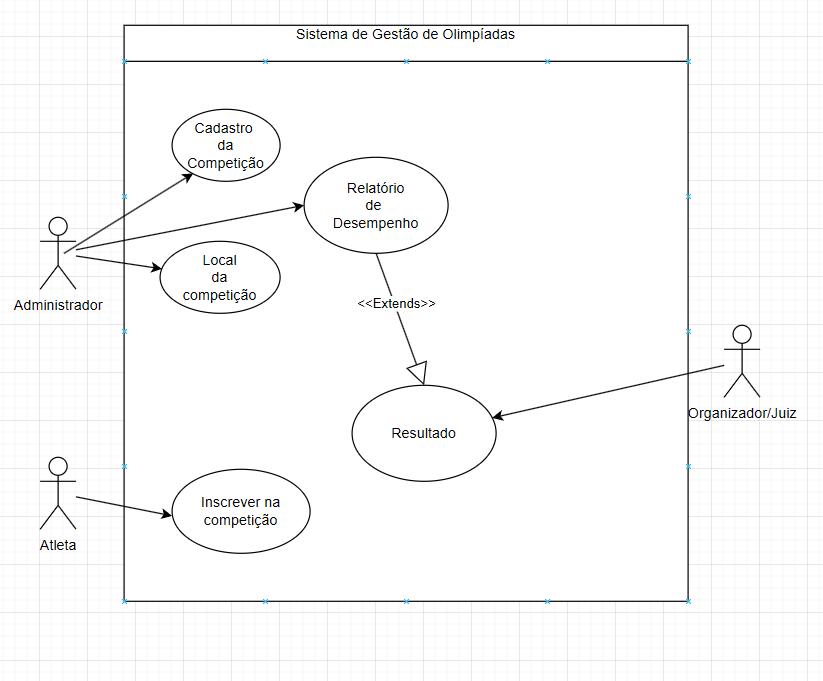
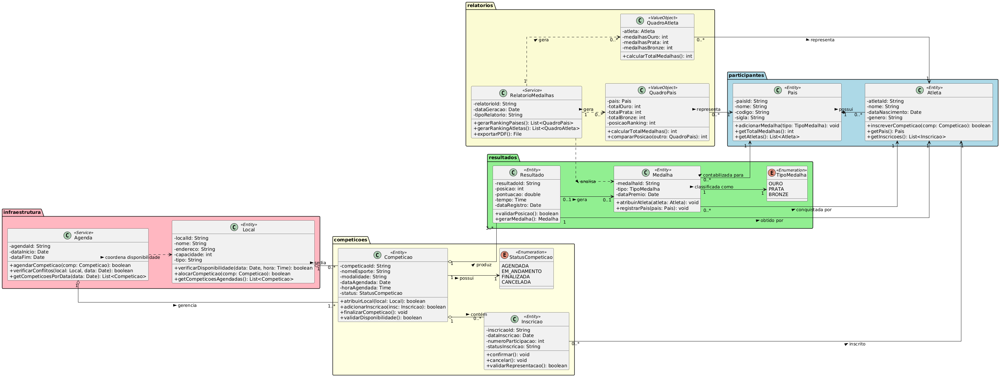
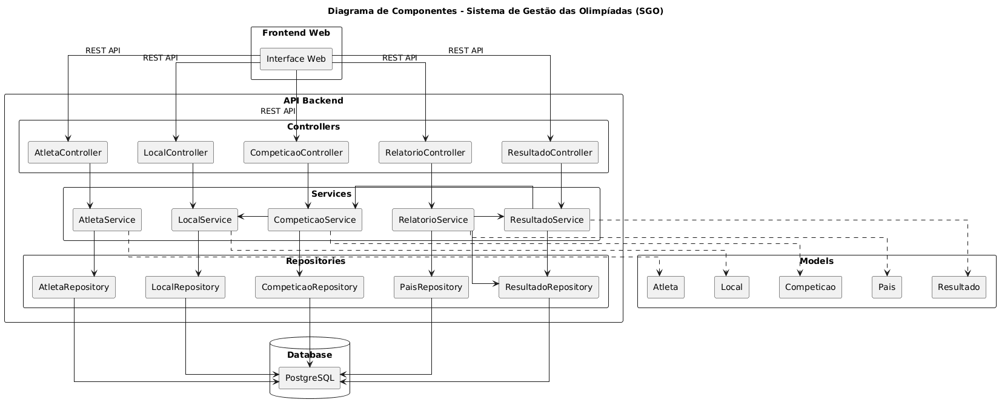
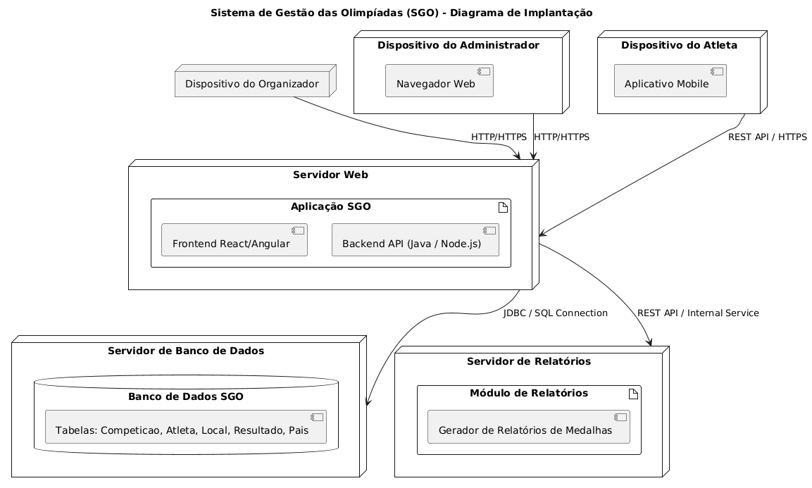

# 🏅 Sistema de Gestão das Olimpíadas (SGO)

Documentação técnica e diagramas do **Sistema de Gestão das Olimpíadas (SGO)** — um sistema proposto para gerenciar competições, inscrições de atletas, alocação de locais, controle de resultados e relatórios de medalhas.

---

## 📘 Descrição do Sistema

Com a chegada das Olimpíadas, o SGO tem como objetivo centralizar e automatizar a gestão do evento, oferecendo controle sobre as **competições**, **atletas**, **locais** e **resultados**, além de gerar relatórios de desempenho por país.

---

## 📊 Diagramas UML

### 🎯 Diagrama de Caso de Uso
Principais atores e funcionalidades do sistema.

### 🧩 Diagrama de Classes e Pacotes
Representa a estrutura interna do sistema e separação por responsabilidades.

### 🧩 Diagrama de Componentes
Representa a estrutura interna do sistema e separação por responsabilidades.

### 🖥️ Diagrama de Implantação
Mostra a arquitetura física do sistema, incluindo servidores, banco de dados e dispositivos de acesso.

---

## 👥 Histórias de Usuário

**US01 - Cadastrar Competição**  
> Como **administrador**, quero **cadastrar novas competições** informando modalidade, data, horário e local, para que elas fiquem disponíveis para inscrições.

**US02 - Inscrever Atleta**  
> Como **atleta**, quero **me inscrever em uma competição específica** representando meu país, para poder participar oficialmente do evento.

**US03 - Alocar Local**  
> Como **administrador**, quero **atribuir locais e horários às competições**, para evitar conflitos e garantir uma boa organização.

**US04 - Registrar Resultados**  
> Como **administrador**, quero **registrar os resultados das competições**, definindo o vencedor e os classificados em segundo e terceiro lugares.

**US05 - Gerar Relatório de Medalhas**  
> Como **organizador**, quero **visualizar um relatório de medalhas por país**, para acompanhar o desempenho geral durante os jogos.

---

## 👨‍💻 Autor

**Gabriel Reis**  
📚 Engenharia de Software  

---
